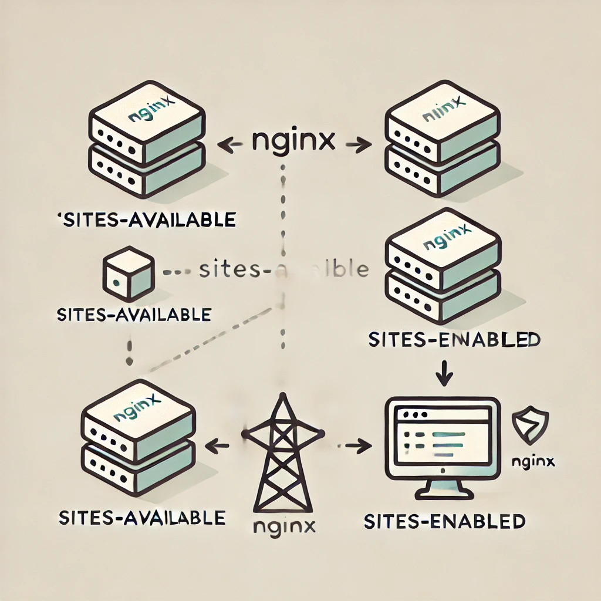

This is 0x19-postmortem project.
A postmortem is an analysis or evaluation conducted after an event, typically a failure or incident, to understand what went wrong and how to prevent similar issues in the future. It often involves:

1. Reviewing Events: Analyzing the sequence of events leading up to the incident.

2. Identifying Causes: Determining the root causes of the failure, whether they are technical, procedural, or human-related.

3. Gathering Feedback: Collecting input from team members involved in the incident to gain different perspectives.

4. Documenting Findings: Compiling the information into a report that outlines the causes, impacts, and lessons learned.

5. Action Items: Recommending specific actions or changes to processes to improve future performance and prevent recurrence.

Using one of the web stack debugging project issue or an outage you have personally face, write a postmortem. Most of you will never have faced an outage, so just get creative and invent your own :)

#0x19-postmortem task using webstack debugging #1

# Issue Summary
Duration of the Outage: The outage started at 11:45 AM and was resolved by 12:45 PM East African Time
# Impact:
The site was not listening on port 80, causing all users to be unable to access the website.

# Root Cause:
The Nginx server's site settings were not properly linked. Specifically, the sites-available configuration was not linked to sites-enabled, meaning the configuration was correct but not activated, preventing users from accessing the site.

# Timeline
11:45 AM: The issue was detected when ALX (the platform) attempted to access the website and found it unresponsive.
11:50 AM: ALX monitoring alerts indicated that the site was down, and the issue was escalated to me.

11:55 AM: Initial investigation focused on checking the Nginx configuration files for errors, but no errors were found in the configuration itself.

12:15 PM: Further investigation led to checking which service was listening on port 80. It was then discovered that the Nginx configuration in sites-available was not linked to sites-enabled.

12:30 PM: The default configuration was correctly linked in sites-enabled, and Nginx was restarted to apply the changes.

12:45 PM: The issue was resolved, and the site was back online.

# Root Cause and Resolution
# Root Cause:
The root cause was the failure to link the sites-available configuration to sites-enabled, meaning the Nginx server configuration was not active despite being correct.

# Resolution:
The issue was resolved by linking the default configuration from sites-available to sites-enabled and restarting the Nginx service.

# Corrective and Preventative Measures

# Improvements:
Ensuring that after any configuration changes, a script or automated check is run to confirm that the necessary configurations are linked and active.
Improve the monitoring system to detect such issues earlier.

# Task List:

Create and execute a script to link the sites-available configuration to sites-enabled after each configuration change.
Add a monitoring check to ensure that Nginx is correctly listening on port 80.

# Example Script
The script i mentioned to ensure the configuration is always active:

______________________________________________________________
[bash]
(Copy code)
#!/usr/bin/env bash
# Ensure Nginx is properly configured and listening on port 80

cat /etc/nginx/sites-available/default > /etc/nginx/sites-enabled/default
sudo service nginx restart
_______________________________________________________________

# This script ensures that the correct configuration is enabled and restarts Nginx to apply the changes.
the flow diagram

